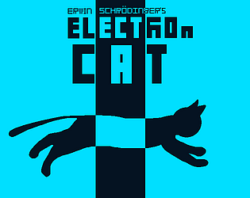
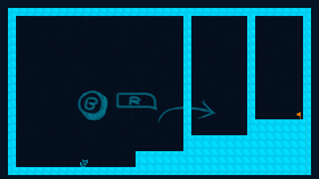

# Erwin Schrödinger's Electron cat
Be the Electron-cat, with the power of quantum tunneling. Finish all tests and claim that Nobel!

 

This is the source code for the Vircon32 port of this short game, i tried my best to port [my PC engine](https://github.com/r-gt/epsilon) to Vircon 32, is not recommended to try using it over the standard API, since performance is not ideal, and there's no real adventage than having an API that works like the original engine. 
  
 

[Here's the Itch.io page.](https://paltra.itch.io/electron-cat) 

---

_made with Ɛ> by @Palta for everyone!
 under the [MIT License](https://opensource.org/license/mit)._